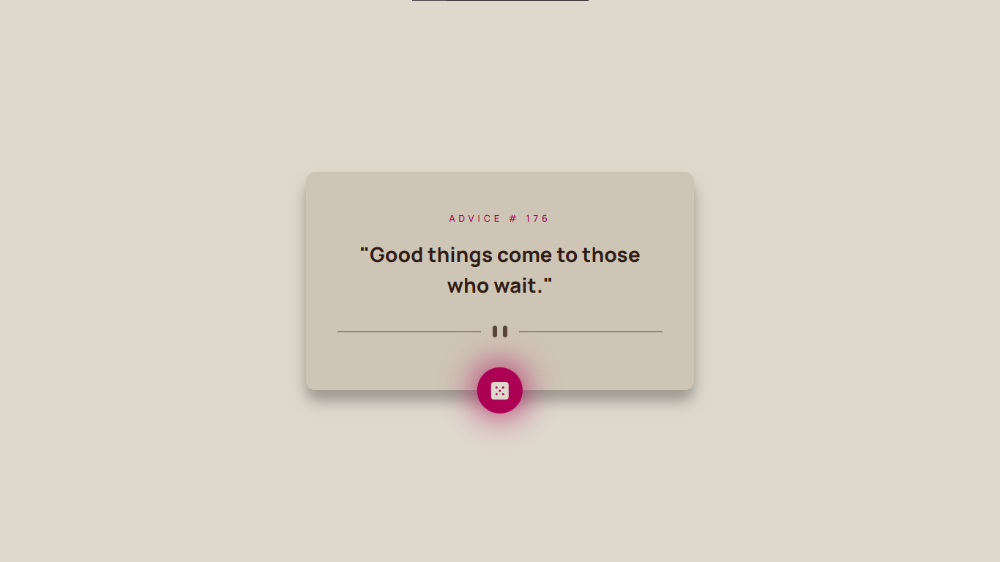

# Frontend Mentor - Advice generator app solution

This is a solution to the [Advice generator app challenge on Frontend Mentor](https://www.frontendmentor.io/challenges/advice-generator-app-QdUG-13db). Frontend Mentor challenges help you improve your coding skills by building realistic projects.

## Table of contents

- [Overview](#overview)
  - [The challenge](#the-challenge)
  - [Screenshot](#screenshot)
  - [Links](#links)
- [My process](#my-process)
  - [Built with](#built-with)
  - [What I learned](#what-i-learned)
  - [Continued development](#continued-development)
- [Author](#author)

## Overview

### The challenge

Users should be able to:

- View the optimal layout for the app depending on their device's screen size
- See hover states for all interactive elements on the page
- Generate a new piece of advice by clicking the dice icon

### Screenshot



### Links

- Solution URL: [Solution]()
- Live Site URL: [Live Site]()

## My process

### Built with

- Semantic HTML5 markup
- CSS custom properties
- Mobile-first workflow
- [VS Code](https://code.visualstudio.com/) - VS Code
- [LiveSassCOmpiler](https://marketplace.visualstudio.com/items?itemName=glenn2223.live-sass) - Sass extension

### What I learned

```js
fetch("https://api.adviceslip.com/advice");
```

### Continued development

HTML, CSS, JS, React

## Author

- GitHub - [VladMishchuk](https://github.com/VladMishchuk)
- Frontend Mentor - [@VladMishchuk](https://www.frontendmentor.io/profile/VladMishchuk)
- Twitter - [@MishchykVlad](https://twitter.com/MishchykVlad)
