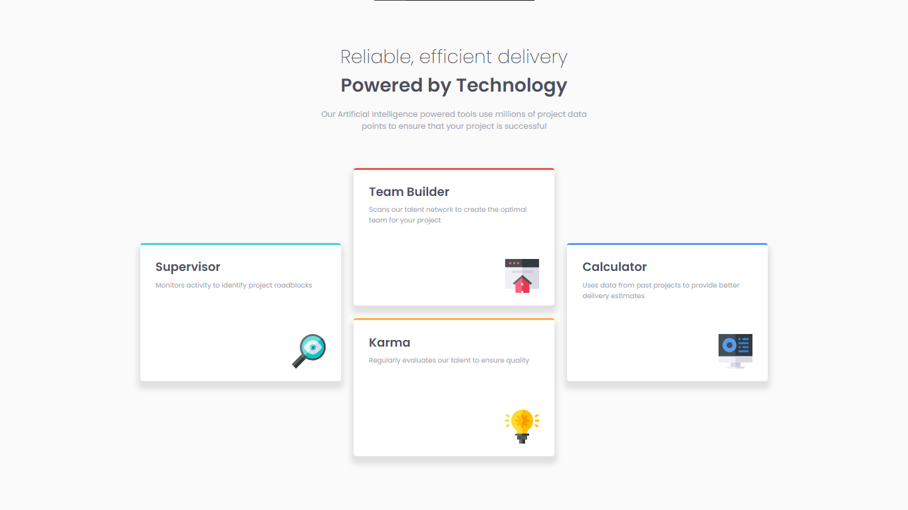

# Frontend Mentor - Four card feature section solution

This is a solution to the [Four card feature section challenge on Frontend Mentor](https://www.frontendmentor.io/challenges/four-card-feature-section-weK1eFYK). Frontend Mentor challenges help you improve your coding skills by building realistic projects.

## Table of contents

- [Overview](#overview)
  - [The challenge](#the-challenge)
  - [Screenshot](#screenshot)
  - [Links](#links)
- [My process](#my-process)
  - [Built with](#built-with)
  - [What I learned](#what-i-learned)
  - [Continued development](#continued-development)
- [Author](#author)

## Overview

### The challenge

Users should be able to:

- View the optimal layout for the site depending on their device's screen size

### Screenshot



### Links

- Solution URL: [Solution]()
- Live Site URL: [Live Site]()

## My process

### Built with

- Semantic HTML5 markup
- CSS custom properties
- Flexbox
- CSS Grid
- Mobile-first workflow
- [VS Code](https://code.visualstudio.com/) - VS Code
- [LiveSassCOmpiler](https://marketplace.visualstudio.com/items?itemName=glenn2223.live-sass) - Sass extension

### What I learned

```scss
/*

when "flex-direction: column;" is set - the picture stretches. Here's how to fix this problem:

*/
article {
  min-height: 10.8rem;
  display: flex;
  flex-direction: column;
  img {
    margin-top: auto;
    align-self: flex-end;
  }
}
```

### Continued development

HTML, CSS, JS, React

## Author

- GitHub - [VladMishchuk](https://github.com/VladMishchuk)
- Frontend Mentor - [@VladMishchuk](https://www.frontendmentor.io/profile/VladMishchuk)
- Twitter - [@MishchykVlad](https://twitter.com/MishchykVlad)
