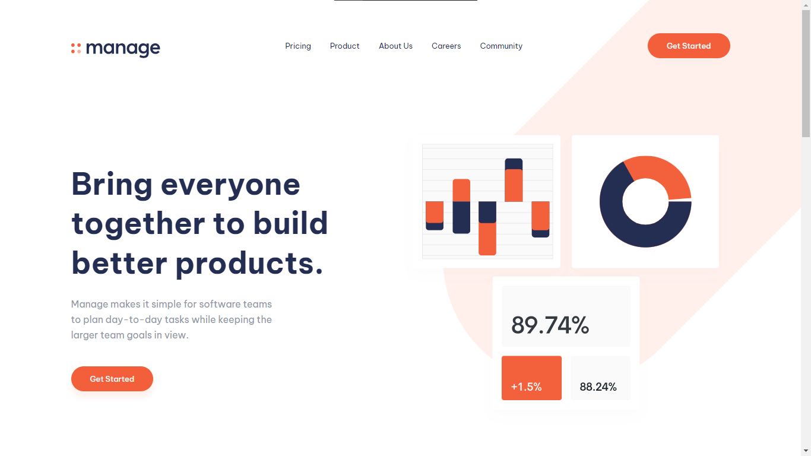

# Frontend Mentor - Manage landing page solution

This is a solution to the [Manage landing page challenge on Frontend Mentor](https://www.frontendmentor.io/challenges/manage-landing-page-SLXqC6P5). Frontend Mentor challenges help you improve your coding skills by building realistic projects.

## Table of contents

- [Overview](#overview)
  - [The challenge](#the-challenge)
  - [Screenshot](#screenshot)
- [My process](#my-process)
  - [Built with](#built-with)
  - [What I learned](#what-i-learned)
  - [Continued development](#continued-development)
  - [Useful resources](#useful-resources)
- [Author](#author)

## Overview

### The challenge

Users should be able to:

- View the optimal layout for the site depending on their device's screen size
- See hover states for all interactive elements on the page
- See all testimonials in a horizontal slider
- Receive an error message when the newsletter sign up `form` is submitted if:
  - The `input` field is empty
  - The email address is not formatted correctly

### Screenshot



## My process

### Built with

- CSS custom properties
- Flexbox
- CSS Grid
- Mobile-first workflow
- [LiveSassCOmpiler](https://marketplace.visualstudio.com/items?itemName=glenn2223.live-sass) - Sass extension
- [Swiper](https://swiperjs.com/) - Slider

### What I learned

```css
.list {
  columns: 2;
}
```

```js
const swiper = new Swiper(".swiper", {
  slidesPerView: 1,
  spaceBetween: 20,
  autoplay: {
    delay: 5000,
  },
  centeredSlides: true,
  autoHeight: true,
  pagination: {
    el: ".swiper-pagination",
    clickable: true,
  },
  breakpoints: {
    500: {
      slidesPerView: 1.5,
    },
    768: {
      slidesPerView: 2,
    },
    1024: {
      slidesPerView: 2.5,
      spaceBetween: 40,
    },
  },
});
```

### Continued development

HTML, CSS, JS, React

### Useful resources

- [Kevin Powell](https://www.youtube.com/@KevinPowell) - Helping you learn how to make the web, and make it look good while you're at it.

## Author

- GitHub - [VladMishchuk](https://github.com/VladMishchuk)
- Frontend Mentor - [@VladMishchuk](https://www.frontendmentor.io/profile/VladMishchuk)
