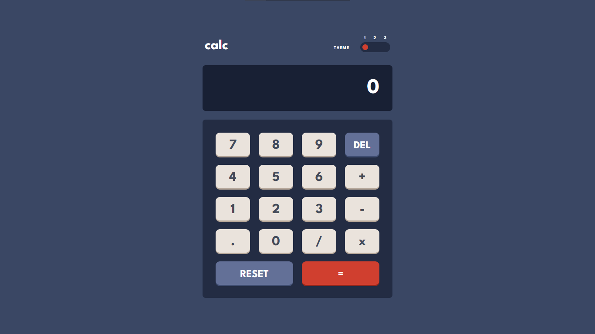

# Frontend Mentor - Calculator app solution

This is a solution to the [Calculator app challenge on Frontend Mentor](https://www.frontendmentor.io/challenges/calculator-app-9lteq5N29). Frontend Mentor challenges help you improve your coding skills by building realistic projects.

## Table of contents

- [Overview](#overview)
  - [The challenge](#the-challenge)
  - [Screenshot](#screenshot)
  - [Links](#links)
  - [Built with](#built-with)
  - [What I learned](#what-i-learned)
  - [Continued development](#continued-development)
- [Author](#author)

### The challenge

Users should be able to:

- See the size of the elements adjust based on their device's screen size
- Perform mathmatical operations like addition, subtraction, multiplication, and division
- Adjust the color theme based on their preference
- **Bonus**: Have their initial theme preference checked using `prefers-color-scheme` and have any additional changes saved in the browser

### Screenshot

### Links

- Solution URL: [Solution](https://www.frontendmentor.io/solutions/calculator-app-o_Skovs5Nw)
- Live Site URL: [Live Site](https://fm-calc-app.netlify.app/)

### Built with

- VS Code
- Semantic HTML5 markup
- CSS custom properties
- Flexbox
- CSS Grid
- JavaScript

### What I learned

- :root
- :has()
- basic of JavaScript
- DOM
- document
- dataset
- addEventListener()
- element.innerHTML[]

### Continued development

JS, React, Node.js

## Author

- GitHub - [VladMishchuk](https://github.com/VladMishchuk)
- Frontend Mentor - [@VladMishchuk](https://www.frontendmentor.io/profile/VladMishchuk)
- Twitter - [@MishchykVlad](https://twitter.com/MishchykVlad)
