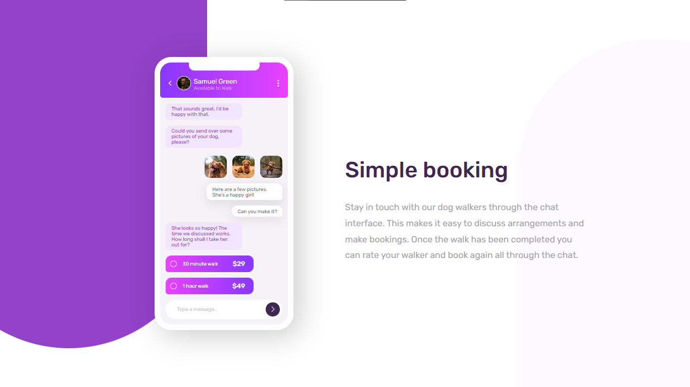

# Frontend Mentor - Chat app CSS illustration solution

This is a solution to the [Chat app CSS illustration challenge on Frontend Mentor](https://www.frontendmentor.io/challenges/chat-app-css-illustration-O5auMkFqY). Frontend Mentor challenges help you improve your coding skills by building realistic projects. 

### The challenge

Users should be able to:

- View the optimal layout for the component depending on their device's screen size
- **Bonus**: See the chat interface animate on the initial load

### Screenshot

### Links

- Solution URL: [Solution](https://www.frontendmentor.io/solutions/chat-app-gjZiCRtA2x)
- Live Site URL: [Live Site](https://fm-chat-app.netlify.app)

### Built with

- Semantic HTML5 markup
- CSS custom properties
- Flexbox

### What I learned

- @keyframes
- transform:
- scale()

### Continued development

CSS, JS, React, Node.js

### Useful resources

- [Flaticon](https://www.flaticon.com/free-icons/next) - I use this site for find icons

## Author

- GitHub - [VladMishchuk](https://github.com/VladMishchuk)
- Frontend Mentor - [@VladMishchuk](https://www.frontendmentor.io/profile/VladMishchuk)
- Twitter - [@MishchykVlad](https://twitter.com/MishchykVlad)
